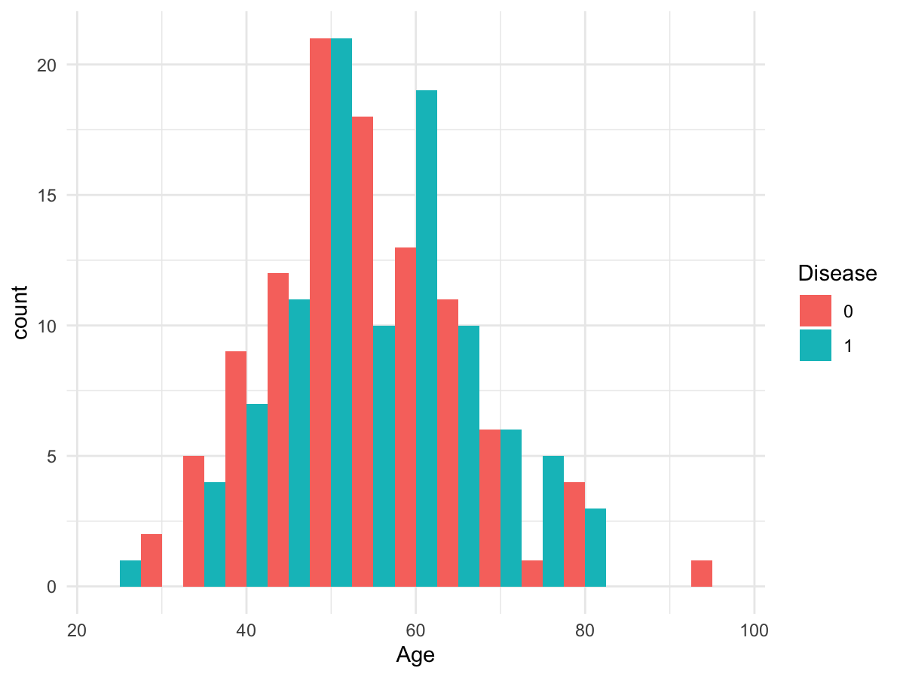
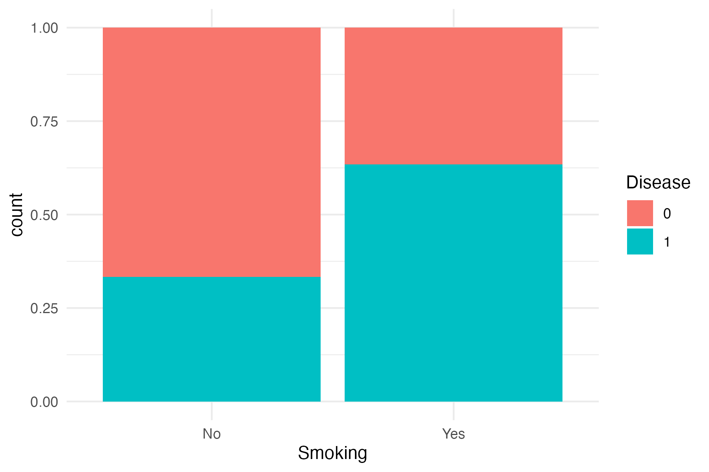
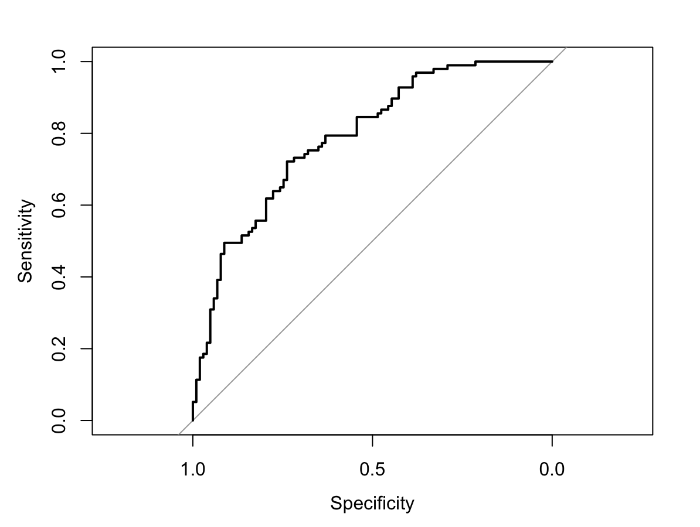

# biostatistics-logistic-regression
Clinical risk prediction using logistic regression in R, with biomarker analysis, odds ratios, and ROC curve evaluation.
# 📊 Biostatistics Logistic Regression Project

## Overview
This project demonstrates the application of logistic regression in R to predict a binary clinical outcome using simulated patient data. The analysis incorporates demographic and biomarker variables to evaluate their association with disease status.

The workflow reflects common approaches used in biostatistics and clinical research, including exploratory data analysis, statistical modeling, and model performance evaluation.

---

## 📁 Project Structure

---

## 🧪 Methods

### 1. Data Simulation
A synthetic clinical dataset was generated, including:
- Age
- Sex
- BMI
- Smoking status
- Biomarker measurements
- Binary disease outcome

### 2. Exploratory Data Analysis (EDA)
- Histograms were used to examine distributions of age and BMI by disease status  
- A proportional bar plot was used to evaluate smoking status and disease prevalence  

### 3. Logistic Regression
A generalized linear model (GLM) with a binomial link function was used:

glm(Disease ~ Age + Sex + BMI + Smoking + Biomarker1 + Biomarker2, family = binomial)

### 4. Model Interpretation
- Coefficients were transformed into **odds ratios**  
- Confidence intervals were calculated to assess statistical significance  

### 5. Model Evaluation
- Predicted probabilities were generated  
- A Receiver Operating Characteristic (ROC) curve was constructed  
- Model performance was evaluated using **Area Under the Curve (AUC)**  

---

## 📈 Results

- Age and BMI showed trends suggesting increased disease risk  
- Smoking status demonstrated a higher proportion of disease cases  
- The logistic regression model achieved an **AUC of approximately 0.79**, indicating good classification performance  

---

## 📊 Visualizations

### Age Distribution by Disease Status

### BMI Distribution by Disease Status

### Smoking Status vs Disease Proportion

### ROC Curve

---

## 🛠️ Tools & Libraries

- R
- ggplot2
- pROC
- stats (glm)

---

## 💡 Key Takeaways

- Logistic regression is a powerful method for modeling binary clinical outcomes  
- Biomarkers and lifestyle factors can significantly influence disease risk  
- ROC curves and AUC provide important measures of model performance  
- This workflow reflects foundational techniques used in biostatistics and clinical data analysis  

---

## 🚀 Future Improvements

- Incorporate real-world clinical datasets  
- Perform feature selection and model optimization  
- Compare with machine learning models (e.g., random forest, XGBoost)  
- Extend analysis to survival modeling (Kaplan–Meier, Cox regression)  

---

## 👩‍🔬 Author

Marianna Wicks  
Background in precision medicine, oncology data abstraction, and clinical research
